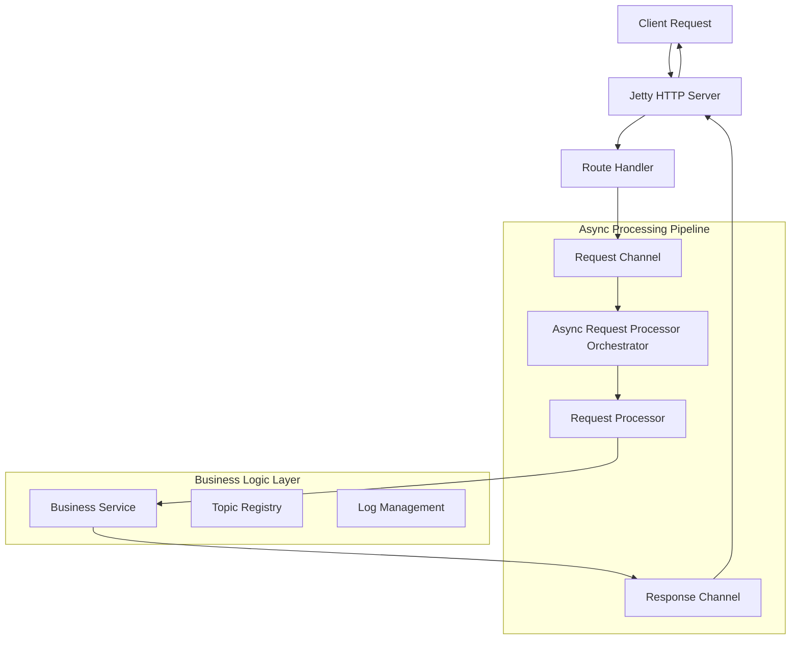
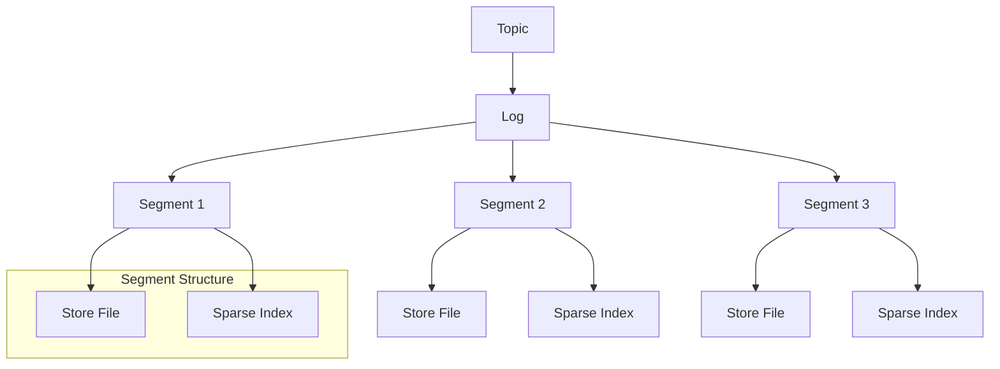
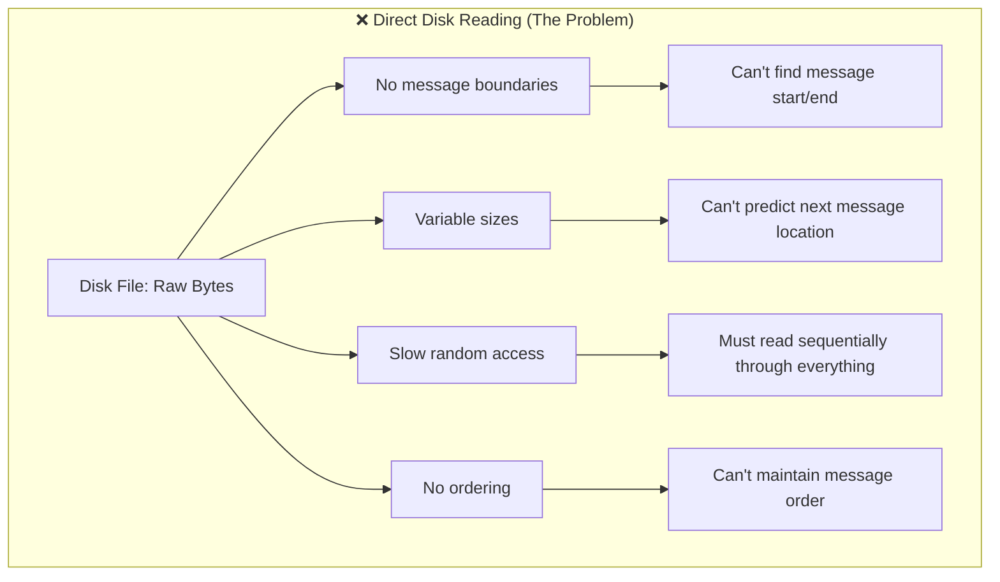
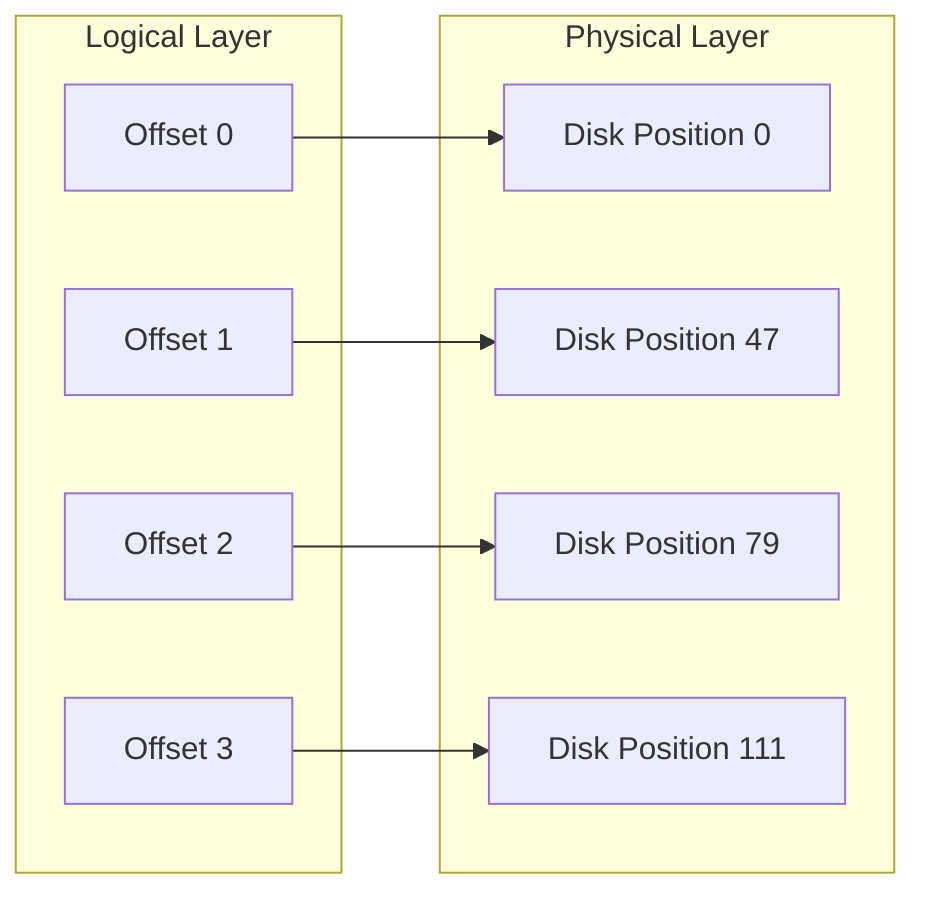
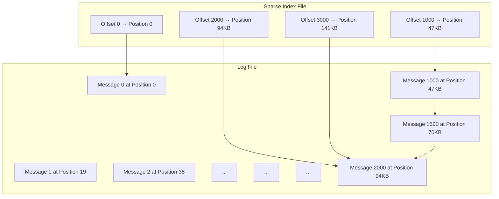
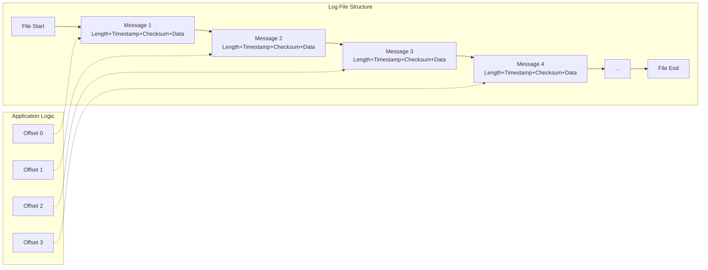
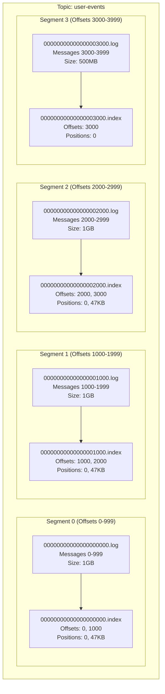
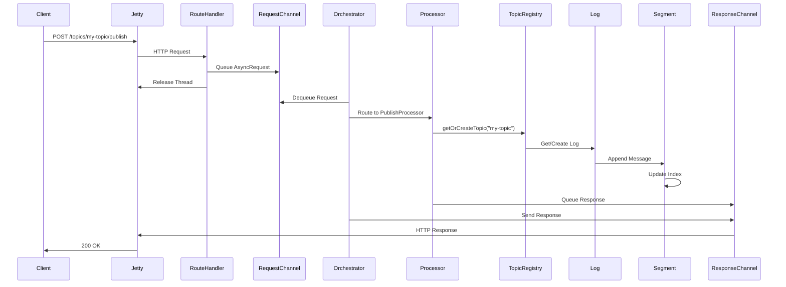

# Lynxes - High-Performance Log-Based Message Streaming System


## Overview

**Lynxes** is a high-performance, log-based message streaming system inspired by the majestic lynx of Egypt. Just as the Egyptian lynx is known for its exceptional hunting skills, speed, and precision, our streaming system delivers messages with unmatched performance, reliability, and efficiency.

Built using a modern asynchronous architecture with log-based storage, Lynxes provides reliable message streaming, high throughput, and durability while maintaining simplicity and efficiency.


## System Architecture

### Asynchronous Processing Pipeline

Lynxes uses a sophisticated asynchronous processing pipeline that separates concerns and maximizes performance:



## Architecture Benefits

### **Why Asynchronous Processing?**
1. **High Concurrency**: Handle thousands of requests with limited threads
2. **Resource Efficiency**: Better CPU and memory utilization
3. **Responsiveness**: Non-blocking operations prevent thread starvation
4. **Scalability**: Easy to scale horizontally

### **Why Log-Based Architecture?**
1. **Simplicity**: Append-only operations are easier to reason about
2. **Performance**: Sequential writes are much faster than random writes
3. **Durability**: Logs provide natural crash recovery
4. **Streaming**: Perfect for continuous message streaming
5. **Proven**: Used by Apache Kafka, Apache Pulsar, and others

### **Why Sparse Indexing?**
1. **Memory Efficiency**: Only indexes every N messages
2. **Fast Lookups**: O(1) access to indexed offsets
3. **Linear Scan**: Efficient scanning for non-indexed offsets
4. **Scalable**: Memory usage doesn't grow with message count

### Core Components

#### 1. **Route Handlers** (`*RouteHandler`)
- **Purpose**: Thin HTTP request handlers that parse URLs and queue requests
- **Responsibilities**:
  - Parse HTTP requests and extract parameters
  - Create `AsyncRequest` objects with request data
  - Queue requests in the `RequestChannel`
  - Release Jetty threads immediately for better concurrency
- **Examples**: `HealthRouteHandler`, `TopicsRouteHandler`, `TopicRouteHandler`

#### 2. **Request Channel**
- **Purpose**: Asynchronous queue for incoming requests
- **Characteristics**:
  - Thread-safe blocking queue
  - Configurable capacity (default: 1000 requests)
  - Non-blocking for producers
  - Fair queuing for consumers

#### 3. **Async Request Processor Orchestrator**
- **Purpose**: Central coordinator for request processing
- **Responsibilities**:
  - Dequeue requests from `RequestChannel`
  - Route requests to appropriate processors
  - Handle processing errors
  - Manage worker threads
- **Worker Threads**: Dedicated I/O threads for processing

#### 4. **Request Processors** (`*RequestProcessor`)
- **Purpose**: Business logic processors for specific request types
- **Strategy Pattern**: Each processor handles one request type
- **Examples**:
  - `HealthRequestProcessor`: System health checks
  - `TopicsRequestProcessor`: Topic listing
  - `PublishRequestProcessor`: Message publishing
  - `ConsumeRequestProcessor`: Message consumption
  - `MetricsRequestProcessor`: System metrics

#### 5. **Response Channel**
- **Purpose**: Asynchronous queue for outgoing responses
- **Characteristics**:
  - Thread-safe response queuing
  - Non-blocking response sending
  - Error handling and logging

### Log-Based Storage Architecture

Lynxes uses a sophisticated log-based storage system inspired by Apache Kafka:



#### **Understanding Disk Storage and Data Retrieval**

**How Disk Storage Actually Works**

Before we dive into why we need offsets and indexes, let's understand the fundamental challenge of storing and retrieving data from disk:

**Disk Storage Basics**:
- **Physical Storage**: Data is stored as bytes at specific physical locations on disk
- **Sequential Layout**: Data is written sequentially, one byte after another
- **No Structure**: The disk doesn't know about "messages" - it only sees raw bytes
- **File System**: The OS provides file boundaries, but not message boundaries

**How Data Retrieval Works**:
- **Sequential Reading**: Reading data in order (byte 0, 1, 2, 3...) is very fast
- **Random Access**: Jumping to specific positions (byte 1000, 5000...) is slower
- **Seek Time**: Moving the disk head to different positions takes time
- **Block Reading**: Disks read data in blocks (typically 4KB), not individual bytes

**Real-World Analogy**: 
Think of disk storage like a massive, continuous scroll of paper:
- **Writing**: You write messages one after another on the scroll
- **Reading**: You can read sequentially (fast) or jump to specific positions (slower)
- **Problem**: The scroll has no page numbers, chapters, or message separators

#### **The Problem with Direct Disk Reading**

**Why We Can't Just Read Messages Directly from Disk**

You might wonder: "Why not just read messages directly from disk files? Why do we need offsets and indexes?"

Let's understand the fundamental problems:

**Problem 1: No Message Boundaries**
- **Disk Reality**: Files are just continuous streams of bytes
- **Our Need**: We want to read individual messages
- **The Gap**: There's no way to know where one message ends and another begins

**Problem 2: Variable Message Sizes**
- **Disk Reality**: All data looks the same (just bytes)
- **Our Need**: Messages can be 1KB, 10KB, or 100KB
- **The Gap**: We can't predict where the next message starts

**Problem 3: Slow Random Access**
- **Disk Reality**: Sequential reading is fast, random jumping is slow
- **Our Need**: We want to read message #1000 without reading messages 1-999
- **The Gap**: We'd have to scan through everything sequentially

**Problem 4: No Order Information**
- **Disk Reality**: Data is just bytes at positions
- **Our Need**: We want to know which message came first, second, third...
- **The Gap**: There's no built-in ordering system

**Visual Representation of the Problem**:



**Performance Impact**:

**Without Offsets (Direct Disk Reading)**:
- Want message #1000? Read through 999 messages first
- Time: O(n) - linear time complexity
- For 1 million messages: Read ~500,000 messages on average
- Very slow! 🐌

**The Solution Preview**:
- Want message #1000? Use index to jump directly to it
- Time: O(1) - constant time complexity  
- For 1 million messages: Direct access in microseconds
- Lightning fast! ⚡

**This is exactly why we need offsets and indexes - they solve these fundamental problems!**

#### **Offsets and Segments**

**What Exactly Are Offsets?**

**Important**: Offsets are **NOT** direct hard disk locations! This is a common misconception.

**What Offsets Actually Are**:
- **Logical Message Numbers**: Sequential identifiers (0, 1, 2, 3, 4...)
- **Message Order**: They represent the order messages were written
- **Consumer Position**: They tell consumers where they are in the message stream
- **Abstract Concept**: They exist in our application logic, not on disk

**What Offsets Are NOT**:
- **Not disk byte positions** (like position 1024, 2048...)
- **Not file offsets** (like seek position in a file)
- **Not physical locations** on the hard disk

**What Offsets ARE**:
- **Logical message identifiers** that have meaning for our application
- **Message order indicators** that tell us which message came first, second, third...
- **Application-level addresses** that help us locate messages on disk
- **Consumer position trackers** that remember where each consumer left off

**How Offsets Map to Disk Locations**:



**How the Mapping Works**:

1. **Offset → Disk Position**: Each offset maps to a specific disk position
   - Offset 2 → Disk position 79
   - *The offset has meaning for our app (message #2), but the disk only knows byte positions*
   
2. **Disk Position → Message Data**: Read from that disk position
   - Position 79 → Read from disk → Get message data
   - *We translate our logical offset into a physical disk location*

**Concrete Example**:

Let's say you want to read message at offset 2:

1. **Step 1**: Look up offset 2 in our mapping
   - Our system says: "Offset 2 is at disk position 79"
   
2. **Step 2**: Read from disk position 79
   - Disk contains: `[Header][Message Data]`
   - We read the message data starting at byte 79

**Real-World Analogy**: 
Think of it like a library catalog system:
- **Offset**: Book number (Book #1000)
- **Mapping**: Catalog that says "Book #1000 is on Shelf 5, Row 3"
- **Disk**: The actual physical shelf where you find the book

**Why This Two-Layer Approach?**

1. **Logical vs Physical Separation**: Offsets provide logical meaning (message order) while disk positions provide physical meaning (where to read)
2. **Abstraction**: Consumers think in terms of "message #1000" not "byte position 47KB"
3. **Efficiency**: Direct mapping provides fast lookup without scanning disk
4. **Flexibility**: Same logical offset system works across different storage backends
5. **Order Preservation**: Offsets maintain message order regardless of where they're physically stored


#### **Index Files and Sparse Indexing**

**How Do We Actually Store and Retrieve Offsets?**

Now that we understand what offsets are, let's see how we actually store and retrieve them. This is where index files come in!

**The Problem**: We have logical offsets (0, 1, 2, 3...) but we need to find the physical disk positions where the messages are stored.

**The Solution**: Index files that map offsets to disk positions.

**Index File Structure**:
```
Index File (.index):
Offset 0    → Position 0    (byte position in log file)
Offset 1000 → Position 47KB (byte position in log file)  
Offset 2000 → Position 94KB (byte position in log file)
Offset 3000 → Position 141KB (byte position in log file)
...
```

**What's Stored in Each Index Entry**:
- **Offset**: The logical message number (0, 1000, 2000...)
- **Position**: The byte position in the log file where the message starts
- **Length**: The size of the message data
- **Checksum**: For data integrity verification

**Why Sparse Indexing?**

**The Problem with Indexing Every Message**:
- **Memory Usage**: Indexing every message would use too much memory
- **File Size**: Index files would be huge
- **Performance**: Writing to index for every message would be slow

**The Solution - Sparse Indexing**:
- **Index Every 1000th Message**: Only store offsets 0, 1000, 2000, 3000...
- **Memory Efficient**: Uses minimal memory
- **Fast Lookup**: O(1) access to indexed offsets
- **Linear Scan**: For non-indexed offsets, scan from nearest index

**How Sparse Indexing Works**:

**Example**: You want to read message at offset 1500

1. **Index Lookup**: Find the closest indexed offset ≤ 1500
   - Index contains: 0, 1000, 2000, 3000...
   - Closest indexed offset: 1000

2. **Jump to Position**: Go to disk position for offset 1000
   - Index says: "Offset 1000 is at position 47KB"

3. **Linear Scan**: Read messages sequentially from position 47KB
   - Read offset 1000, 1001, 1002... until you find offset 1500

**Visual Representation**:



**Benefits of Sparse Indexing**:

1. **Memory Efficient**: Only indexes every 1000th message
2. **Fast Lookups**: O(1) access to indexed offsets
3. **Linear Scan**: Efficient scanning for non-indexed offsets
4. **Scalable**: Memory usage doesn't grow with message count
5. **Performance**: Balances speed with memory usage

**Real-World Analogy**: 
Think of a book with a table of contents:
- **Index**: Lists important chapters (every 100th page)
- **Linear Scan**: To find page 150, you go to chapter 1 (page 100) and scan forward
- **Efficient**: You don't need to list every single page number

#### **Log File Structure with Offsets**

**What Does a Log File Actually Look Like?**

Now that we understand offsets, let's see how messages are actually stored in a log file:

**Log File Content**:
```
[Length: 4][Timestamp: 8][Checksum: 4][Message: "Hello World" - 11 bytes]
[Length: 4][Timestamp: 8][Checksum: 4][Message: "User login" - 10 bytes]  
[Length: 4][Timestamp: 8][Checksum: 4][Message: "Order placed" - 12 bytes]
[Length: 4][Timestamp: 8][Checksum: 4][Message: "Payment processed" - 17 bytes]
[Length: 4][Timestamp: 8][Checksum: 4][Message: "Order shipped" - 13 bytes]
...
```

**Key Observations**:
- **Sequential Storage**: Messages are stored one after another
- **Variable Sizes**: Each message can be different lengths
- **Headers**: Each message has metadata (length, timestamp, checksum)
- **No Offsets**: Offsets are not stored with the message data
- **Growing File**: As more messages arrive, the file keeps growing
- **Offset Mapping**: Offsets exist separately in the index/mapping system

**Visual Representation**:



**Real-World Analogy**: 
Think of a log file like a continuous diary:
- **Each Entry**: Represents one message (but without page numbers)
- **Sequential Writing**: You write entries one after another
- **Variable Length**: Some entries are short, others are long
- **Growing Diary**: The diary gets longer as you add more entries
- **Page Numbers**: The page numbers (offsets) exist in a separate index, not in the diary itself

#### **Segments**

**The Problem with Single Large Files**

Imagine if we stored all messages for a topic in one massive file:

**Problems with One Giant File**:
- **File Size**: Could grow to terabytes (millions of messages)
- **Memory Usage**: Loading the entire file into memory would be impossible
- **Recovery Time**: If the file gets corrupted, we lose everything
- **Backup Issues**: Backing up a 1TB file takes hours
- **Search Performance**: Finding a specific message requires scanning the entire file
- **Concurrent Access**: Multiple processes can't safely access the same huge file

**Real-World Analogy**: 
Think of a library with one massive book containing all stories:
- **Problem**: The book becomes too heavy to carry
- **Problem**: If it gets damaged, you lose all stories
- **Problem**: Finding a specific story requires flipping through thousands of pages
- **Solution**: Split it into chapters (segments) - each chapter is manageable

**How Segments Solve These Problems?**:

1. **Manageable Size**: Each segment has a reasonable size (default: 1GB)
2. **Faster Recovery**: If one segment is corrupted, others remain intact
3. **Efficient Memory Usage**: Only load the segments you need
4. **Parallel Processing**: Multiple segments can be processed simultaneously
5. **Easy Cleanup**: Delete old segments without affecting active ones
6. **Better Performance**: Faster to search within smaller files

#### **How Segments Work**

**Segments** are the fundamental storage units:
- **Purpose**: Break large topics into manageable files (like chapters in a book)
- **Size Limit**: Configurable maximum size (default: 1GB)
- **Rotation**: Automatic creation of new segments when full
- **Cleanup**: Old segments deleted based on retention policy

#### **Topic Storage Structure**

**How Topics Are Organized with Segments**

Let's see how a topic with many messages is actually stored using segments:

**Topic Structure**:
```
Topic: "user-events"
├── Segment 0: 00000000000000000000.log + 00000000000000000000.index
├── Segment 1: 00000000000000001000.log + 00000000000000001000.index  
├── Segment 2: 00000000000000002000.log + 00000000000000002000.index
└── Segment 3: 00000000000000003000.log + 00000000000000003000.index
```

**Visual Representation**:



**Segment Naming Convention**:
- **Log Files**: `{offset}.log` (e.g., `00000000000000000000.log`)
- **Index Files**: `{offset}.index` (e.g., `00000000000000000000.index`)
- **Offset**: The starting offset for messages in this segment

**How Messages Are Distributed**:
- **Segment 0**: Contains offsets 0, 1, 2... 999
- **Segment 1**: Contains offsets 1000, 1001, 1002... 1999
- **Segment 2**: Contains offsets 2000, 2001, 2002... 2999
- **Segment 3**: Contains offsets 3000, 3001, 3002... (current active segment)

**Segment Rotation Process**:

1. **Writing Messages**: New messages are written to the current active segment
2. **Size Check**: When segment reaches 1GB, it's marked as full
3. **New Segment**: A new segment is created with the next offset
4. **Index Update**: Each segment maintains its own index file
5. **Cleanup**: Old segments are deleted based on retention policy

**Benefits of This Structure**:

1. **Manageable Files**: Each segment is a reasonable size (1GB max)
2. **Independent Indexes**: Each segment has its own index for fast lookups
3. **Parallel Processing**: Multiple segments can be processed simultaneously
4. **Easy Cleanup**: Delete entire segments when retention expires
5. **Fault Isolation**: If one segment is corrupted, others remain intact
6. **Scalable**: Can handle topics with millions of messages


### Data Flow Example

Here's how a message flows through the system:




## API Endpoints

### **Core Operations**
- `GET /health` - System health check
- `GET /topics` - List all topics
- `POST /topics/{topic}/publish` - Publish message
- `GET /topics/{topic}?offset={n}` - Consume message at offset
- `GET /metrics` - System metrics

### **Consumer Operations**
- `POST /consumers` - Create consumer
- `POST /consumers/{id}/subscribe` - Subscribe to topic
- `GET /consumers/{id}/messages` - Consume messages

### **Consumer Group Operations**
- `POST /consumer-groups` - Create consumer group
- `POST /consumer-groups/{group}/subscribe` - Subscribe group to topic
- `GET /consumer-groups/{group}/messages` - Consume messages

## Configuration Management

### **Why Configuration Files?**

Lynxes uses external configuration files instead of hardcoded values because:

- **Flexibility**: Change settings without recompiling code
- **Environment-Specific**: Different settings for development, testing, and production
- **Runtime Changes**: Update configuration without restarting the server
- **Best Practices**: Separates code from configuration

### **Configuration Sources**

Lynxes reads configuration from multiple sources in order of priority:

1. **Command Line Arguments**: Highest priority
2. **Environment Variables**: System environment variables
3. **Configuration Files**: `application.conf`, `application-dev.conf`, `application-prod.conf`
4. **Default Values**: Built-in defaults as fallback

### **Configuration File Format**

We use **HOCON** (Human-Optimized Config Object Notation) format because it's:
- **Human-Readable**: Easy to understand and edit
- **Hierarchical**: Organized structure with nested properties
- **Flexible**: Supports comments, substitutions, and includes
- **Type-Safe**: Validates configuration at startup

### **Server Configuration**
```hocon
lynxes {
  server {
    port = 8080
    threadPoolSize = 10
  }
  
  storage {
    dataDirectory = "./data"
    maxSegmentSize = 1048576  # 1MB
    retentionPeriodMs = 604800000  # 7 days
    indexInterval = 1024  # Index every 1KB
    maxMessageSize = 1048576  # 1MB
  }
  
  performance {
    enableCompression = false
    enableMetrics = true
    flushIntervalMs = 1000
    maxConcurrentConnections = 1000
    enableBatching = true
    batchSize = 100
  }
}
```

### **Environment-Specific Configuration**

**Development Environment** (`application-dev.conf`):
```hocon
lynxes {
  server {
    port = 8080
  }
  storage {
    dataDirectory = "./data-dev"
  }
  logging {
    level = "DEBUG"
  }
}
```

**Production Environment** (`application-prod.conf`):
```hocon
lynxes {
  server {
    port = 80
  }
  storage {
    dataDirectory = "/var/lib/lynxes"
    maxSegmentSize = 1073741824  # 1GB
  }
  logging {
    level = "INFO"
    file = "/var/log/lynxes/lynxes.log"
  }
}
```

## Dependency Injection Container

### **Why Dependency Injection?**

Lynxes uses **Google Guice** as a dependency injection container because:

- **Loose Coupling**: Components don't create their dependencies directly
- **Testability**: Easy to mock dependencies for unit testing
- **Configuration**: Centralized object creation and configuration
- **Lifecycle Management**: Automatic management of object lifecycles
- **Modularity**: Clean separation between components

### **Real-World Analogy**

Think of dependency injection like a smart factory manager:
- **Factory Manager**: Knows how to create all the parts
- **Workers**: Just ask for the tools they need
- **Quality Control**: Ensures all parts are properly configured
- **Efficiency**: Reuses components when possible

### **How It Works in Lynxes**

```java
// Instead of this (tightly coupled):
public class PublishRequestProcessor {
    private TopicService topicService = new TopicService(); // Hard to test!
}

// We do this (loosely coupled):
public class PublishRequestProcessor {
    private final TopicService topicService;
    
    @Inject
    public PublishRequestProcessor(TopicService topicService) {
        this.topicService = topicService; // Injected by Guice!
    }
}
```

### **Benefits**

1. **Easy Testing**: Mock dependencies for unit tests
2. **Flexible Configuration**: Change implementations without code changes
3. **Single Responsibility**: Each class focuses on its core functionality
4. **Automatic Wiring**: Guice automatically creates and wires objects
5. **Lifecycle Management**: Handles object creation, configuration, and cleanup

### **Guice Module Configuration**

```java
public class LynxesModule extends AbstractModule {
    @Override
    protected void configure() {
        // Bind interfaces to implementations
        bind(TopicService.class).in(Singleton.class);
        bind(MessageService.class).in(Singleton.class);
        
        // Configure request processors
        bind(RequestProcessorFactory.class).in(Singleton.class);
    }
    
    @Provides
    @Singleton
    public QueueConfig provideQueueConfig() {
        return ConfigLoader.loadConfig();
    }
}
```

## Getting Started

### **Prerequisites**
- Java 11 or higher
- Maven 3.6 or higher
- 4GB+ RAM (for memory-mapped files)
- SSD storage (recommended for performance)

### **Building**
```bash
mvn clean compile
```

### **Running**
```bash
mvn exec:java -Dexec.mainClass="org.mahmoud.lynxes.Lynxes"
```

### **Testing**
```bash
# Health check
curl http://localhost:8080/health

# List topics
curl http://localhost:8080/topics

# Publish message
curl -X POST http://localhost:8080/topics/my-topic/publish \
  -H "Content-Type: application/json" \
  -d '{"message":"Hello Lynxes!"}'

# Consume message
curl http://localhost:8080/topics/my-topic?offset=0
```

## Monitoring and Metrics

Lynxes provides comprehensive metrics for monitoring:

- **Request Metrics**: Request count, latency, error rates
- **Queue Metrics**: Queue size, utilization, backpressure
- **Storage Metrics**: Segment count, disk usage, retention
- **Performance Metrics**: Throughput, memory usage, CPU usage

## Future Enhancements

- **Clustering**: Multi-node deployment with leader election
- **Streaming**: Real-time message streaming with WebSockets
- **Schema Registry**: Message schema management and validation
- **Dead Letter Queue**: Failed message handling and retry
- **Metrics Integration**: Prometheus/InfluxDB integration
- **Distributed Tracing**: OpenTelemetry support
- **Security**: Authentication and authorization
- **Compression**: Message payload compression

## Contributing

We welcome contributions to Lynxes! Please see our [Contributing Guidelines](CONTRIBUTING.md) for details.

1. Fork the repository
2. Create a feature branch
3. Make your changes
4. Add tests
5. Submit a pull request

## License

This project is licensed under the MIT License - see the [LICENSE](LICENSE) file for details.

---

*Built with the speed and precision of the Egyptian lynx* 🐾