# Lynxes - High-Performance Message Queue Server


## Overview

**Lynxes** is a high-performance, persistent message queue server inspired by the majestic lynx of Egypt. Just as the Egyptian lynx is known for its exceptional hunting skills, speed, and precision, our message queue system delivers messages with unmatched performance, reliability, and efficiency.

Built using a modern asynchronous architecture with log-based storage, Lynxes provides reliable message delivery, high throughput, and durability while maintaining simplicity and efficiency.

## The Egyptian Lynx Connection

The **Egyptian lynx** (*Lynx lynx*) is a remarkable predator native to Egypt, known for:
- **Exceptional Speed**: Lightning-fast reflexes and movement
- **Precision Hunting**: Accurate targeting and efficient capture
- **Adaptability**: Thrives in diverse environments
- **Reliability**: Consistent performance in challenging conditions

Our Lynxes message queue embodies these same characteristics:
- **High Performance**: Lightning-fast message processing
- **Precision Delivery**: Accurate message routing and delivery
- **Adaptable Architecture**: Flexible and scalable design
- **Reliable Operation**: Consistent performance under load

## System Architecture

### Asynchronous Processing Pipeline

Lynxes uses a sophisticated asynchronous processing pipeline that separates concerns and maximizes performance:


### Core Components

#### 1. **Route Handlers** (`*RouteHandler`)
- **Purpose**: Thin HTTP request handlers that parse URLs and queue requests
- **Responsibilities**:
  - Parse HTTP requests and extract parameters
  - Create `AsyncRequest` objects with request data
  - Queue requests in the `RequestChannel`
  - Release Jetty threads immediately for better concurrency
- **Examples**: `HealthRouteHandler`, `TopicsRouteHandler`, `TopicRouteHandler`

#### 2. **Request Channel**
- **Purpose**: Asynchronous queue for incoming requests
- **Characteristics**:
  - Thread-safe blocking queue
  - Configurable capacity (default: 1000 requests)
  - Non-blocking for producers
  - Fair queuing for consumers

#### 3. **Async Request Processor Orchestrator**
- **Purpose**: Central coordinator for request processing
- **Responsibilities**:
  - Dequeue requests from `RequestChannel`
  - Route requests to appropriate processors
  - Handle processing errors
  - Manage worker threads
- **Worker Threads**: Dedicated I/O threads for processing

#### 4. **Request Processors** (`*RequestProcessor`)
- **Purpose**: Business logic processors for specific request types
- **Strategy Pattern**: Each processor handles one request type
- **Examples**:
  - `HealthRequestProcessor`: System health checks
  - `TopicsRequestProcessor`: Topic listing
  - `PublishRequestProcessor`: Message publishing
  - `ConsumeRequestProcessor`: Message consumption
  - `MetricsRequestProcessor`: System metrics

#### 5. **Response Channel**
- **Purpose**: Asynchronous queue for outgoing responses
- **Characteristics**:
  - Thread-safe response queuing
  - Non-blocking response sending
  - Error handling and logging

### Log-Based Storage Architecture

Lynxes uses a sophisticated log-based storage system inspired by Apache Kafka:


#### **Why We Can't Read From Disk Directly**

**The Problem with Direct Disk Reading**

You might wonder: "Why not just read messages directly from disk files? Why do we need offsets and indexes?"

Let's understand how disk reading actually works:

**How Disk Reading Works**:
- **Physical Location**: Data is stored at specific physical locations on disk
- **Byte Positions**: Each piece of data has a byte position (like position 0, 1024, 2048...)
- **Sequential Access**: Reading data sequentially is fast
- **Random Access**: Jumping to random positions is slow

**Why Direct Disk Reading is Inefficient**:

1. **No Message Boundaries**: Disk files are just bytes. We don't know where one message ends and another begins
2. **Variable Message Sizes**: Messages can be different sizes (1KB, 10KB, 100KB)
3. **Slow Random Access**: Jumping to random positions on disk is much slower than sequential reading
4. **No Order Information**: We can't tell which message came first, second, third...

**Real-World Analogy**: 
Imagine a library where all books are stored as one continuous stream of text without any page breaks, chapters, or book separators. You'd have to:
- Read through everything to find a specific book
- Guess where one book ends and another begins
- Read sequentially through thousands of pages to find what you want

**Visual Comparison**:


**Performance Comparison**:

**Without Offsets (Direct Disk Reading)**:
- Want message #1000? Read through 999 messages first
- Time: O(n) - linear time complexity
- For 1 million messages: Read ~500,000 messages on average
- Very slow! 🐌

**With Offsets and Indexes**:
- Want message #1000? Use index to jump directly to it
- Time: O(1) - constant time complexity  
- For 1 million messages: Direct access in microseconds
- Lightning fast! ⚡

**The Solution: Offsets and Indexes**

This is exactly why we need offsets and indexes - they solve these fundamental problems!

#### **Offsets and Segments**

**What Exactly Are Offsets?**

**Important**: Offsets are **NOT** direct hard disk locations! This is a common misconception.

**What Offsets Actually Are**:
- **Logical Message Numbers**: Sequential identifiers (0, 1, 2, 3, 4...)
- **Message Order**: They represent the order messages were written
- **Consumer Position**: They tell consumers where they are in the message stream
- **Abstract Concept**: They exist in our application logic, not on disk

**What Offsets Are NOT**:
- ❌ **Not disk byte positions** (like position 1024, 2048...)
- ❌ **Not file offsets** (like seek position in a file)
- ❌ **Not physical locations** on the hard disk

**How Offsets Map to Disk Locations**:

```mermaid
graph LR
    subgraph "Logical Layer"
        Offset0[Offset 0]
        Offset1[Offset 1] 
        Offset2[Offset 2]
        Offset3[Offset 3]
    end
    
    subgraph "Index Layer"
        Index0[Index: 0 → Position 0]
        Index1[Index: 1 → Position 47]
        Index2[Index: 2 → Position 79]
        Index3[Index: 3 → Position 111]
    end
    
    subgraph "Physical Layer"
        Disk0[Disk Position 0]
        Disk1[Disk Position 47]
        Disk2[Disk Position 79]
        Disk3[Disk Position 111]
    end
    
    Offset0 --> Index0
    Offset1 --> Index1
    Offset2 --> Index2
    Offset3 --> Index3
    
    Index0 --> Disk0
    Index1 --> Disk1
    Index2 --> Disk2
    Index3 --> Disk3
```



**The Two-Step Process**:

1. **Offset → Index Lookup**: Find the disk position for an offset
   - Offset 2 → Look in index → Find position 79
   
2. **Index → Disk Read**: Read from that disk position
   - Position 79 → Read from disk → Get message data

**Concrete Example**:

Let's say you want to read message at offset 2:

1. **Step 1**: Look up offset 2 in the sparse index
   - Index says: "Offset 2 is at disk position 79"
   
2. **Step 2**: Read from disk position 79
   - Disk contains: `[Header][Message Data]`
   - We read the message data starting at byte 79

**Real-World Analogy**: 
Think of it like a library catalog system:
- **Offset**: Book number (Book #1000)
- **Index**: Catalog card that says "Book #1000 is on Shelf 5, Row 3"
- **Disk**: The actual physical shelf where you find the book

**Why This Two-Layer Approach?**

1. **Flexibility**: Offsets can be reassigned if needed (though we don't do this)
2. **Abstraction**: Consumers don't need to know about disk internals
3. **Efficiency**: Index provides fast lookup without scanning disk
4. **Portability**: Same offset system works across different storage backends

**Why Do We Need Offsets?**

Think of offsets like page numbers in a book. When you want to find a specific message, you need a way to locate it quickly. Offsets solve this problem:

- **Unique Addresses**: Each message gets a unique "address" (offset) like 0, 1, 2, 3...
- **Resume Reading**: If your application crashes, you can resume from where you left off
- **Multiple Consumers**: Different applications can read from different positions simultaneously
- **Order Guarantee**: Messages are always delivered in the correct order

**Real-World Analogy**: Imagine a library where every book has a unique shelf number. You can:
- Find any book instantly by its shelf number
- Resume reading from where you left off
- Let multiple people read different books simultaneously
- Always know the order of books on the shelf

**Segments** are the fundamental storage units:
- **Purpose**: Break large topics into manageable files (like chapters in a book)
- **Size Limit**: Configurable maximum size (default: 1GB)
- **Rotation**: Automatic creation of new segments when full
- **Cleanup**: Old segments deleted based on retention policy

#### **Sparse Indexing**

**Why Do We Need Indexes?**

Without an index, finding a specific message would be like searching through a book page by page. Indexes make this lightning-fast:

- **Speed**: Find any message instantly instead of scanning through thousands
- **Memory Efficiency**: Only remember key positions, not every single message
- **Scalability**: Works efficiently even with millions of messages

**Real-World Analogy**: Like a book's index that points to important pages. You don't need to remember every word, just the key locations.

Our sparse index system provides efficient offset-to-position mapping:


**How It Works**:
1. **Index Every 1000 Messages**: Instead of indexing every message, we index every 1000th message
2. **Fast Lookup**: When you want message #1500, we find the nearest index (1000) and scan forward
3. **Memory Efficient**: Uses minimal memory while providing excellent performance
4. **Scalable**: Works efficiently even with billions of messages

**Benefits**:
- **Memory Efficient**: Only indexes every N messages (default: 1000)
- **Fast Lookups**: O(1) access to indexed offsets
- **Linear Scan**: For non-indexed offsets, scan from nearest index
- **Scalable**: Memory usage doesn't grow with message count

### Data Flow Example

Here's how a message flows through the system:


## Key Features

### **Asynchronous Processing**

**Why Asynchronous Processing?**

Imagine a restaurant with two approaches:

**Traditional Approach (Synchronous)**:
- One waiter takes your order, cooks the food, serves it, then takes the next order
- Only one customer served at a time
- Very slow and inefficient

**Our Approach (Asynchronous)**:
- Waiter takes your order and gives it to the kitchen
- Waiter immediately takes the next customer's order
- Kitchen staff cook the food in parallel
- Food is served when ready
- Many customers served simultaneously

**Benefits**:
- **Non-blocking I/O**: Jetty threads released immediately (like the waiter)
- **Dedicated Workers**: Separate threads for business logic (like kitchen staff)
- **High Concurrency**: Handle thousands of concurrent requests
- **Backpressure**: Queue-based flow control (like managing kitchen capacity)

### **High Performance**
- **Sequential Writes**: Append-only log files for maximum throughput
- **Memory-Mapped Files**: Direct memory access for reads
- **Sparse Indexing**: Efficient offset lookups
- **Zero-Copy**: Minimal data copying in the pipeline

### **Reliability**
- **Durability**: All writes fsync'd to disk
- **Crash Recovery**: Automatic state recovery from disk
- **Data Integrity**: Checksums and validation
- **Atomic Operations**: Consistent state management

### **Scalability**
- **Segment Rotation**: Automatic disk space management
- **Memory Efficiency**: Memory-mapped files with sparse indexing
- **Concurrent Access**: Thread-safe operations
- **Horizontal Scaling**: Ready for clustering

## API Endpoints

### **Core Operations**
- `GET /health` - System health check
- `GET /topics` - List all topics
- `POST /topics/{topic}/publish` - Publish message
- `GET /topics/{topic}?offset={n}` - Consume message at offset
- `GET /metrics` - System metrics

### **Consumer Operations**
- `POST /consumers` - Create consumer
- `POST /consumers/{id}/subscribe` - Subscribe to topic
- `GET /consumers/{id}/messages` - Consume messages

### **Consumer Group Operations**
- `POST /consumer-groups` - Create consumer group
- `POST /consumer-groups/{group}/subscribe` - Subscribe group to topic
- `GET /consumer-groups/{group}/messages` - Consume messages

## Configuration Management

### **Why Configuration Files?**

Lynxes uses external configuration files instead of hardcoded values because:

- **Flexibility**: Change settings without recompiling code
- **Environment-Specific**: Different settings for development, testing, and production
- **Runtime Changes**: Update configuration without restarting the server
- **Best Practices**: Separates code from configuration

### **Configuration Sources**

Lynxes reads configuration from multiple sources in order of priority:

1. **Command Line Arguments**: Highest priority
2. **Environment Variables**: System environment variables
3. **Configuration Files**: `application.conf`, `application-dev.conf`, `application-prod.conf`
4. **Default Values**: Built-in defaults as fallback

### **Configuration File Format**

We use **HOCON** (Human-Optimized Config Object Notation) format because it's:
- **Human-Readable**: Easy to understand and edit
- **Hierarchical**: Organized structure with nested properties
- **Flexible**: Supports comments, substitutions, and includes
- **Type-Safe**: Validates configuration at startup

### **Server Configuration**
```hocon
lynxes {
  server {
    port = 8080
    threadPoolSize = 10
  }
  
  storage {
    dataDirectory = "./data"
    maxSegmentSize = 1048576  # 1MB
    retentionPeriodMs = 604800000  # 7 days
    indexInterval = 1024  # Index every 1KB
    maxMessageSize = 1048576  # 1MB
  }
  
  performance {
    enableCompression = false
    enableMetrics = true
    flushIntervalMs = 1000
    maxConcurrentConnections = 1000
    enableBatching = true
    batchSize = 100
  }
}
```

### **Environment-Specific Configuration**

**Development Environment** (`application-dev.conf`):
```hocon
lynxes {
  server {
    port = 8080
  }
  storage {
    dataDirectory = "./data-dev"
  }
  logging {
    level = "DEBUG"
  }
}
```

**Production Environment** (`application-prod.conf`):
```hocon
lynxes {
  server {
    port = 80
  }
  storage {
    dataDirectory = "/var/lib/lynxes"
    maxSegmentSize = 1073741824  # 1GB
  }
  logging {
    level = "INFO"
    file = "/var/log/lynxes/lynxes.log"
  }
}
```

## Dependency Injection Container

### **Why Dependency Injection?**

Lynxes uses **Google Guice** as a dependency injection container because:

- **Loose Coupling**: Components don't create their dependencies directly
- **Testability**: Easy to mock dependencies for unit testing
- **Configuration**: Centralized object creation and configuration
- **Lifecycle Management**: Automatic management of object lifecycles
- **Modularity**: Clean separation between components

### **Real-World Analogy**

Think of dependency injection like a smart factory manager:
- **Factory Manager**: Knows how to create all the parts
- **Workers**: Just ask for the tools they need
- **Quality Control**: Ensures all parts are properly configured
- **Efficiency**: Reuses components when possible

### **How It Works in Lynxes**

```java
// Instead of this (tightly coupled):
public class PublishRequestProcessor {
    private TopicService topicService = new TopicService(); // Hard to test!
}

// We do this (loosely coupled):
public class PublishRequestProcessor {
    private final TopicService topicService;
    
    @Inject
    public PublishRequestProcessor(TopicService topicService) {
        this.topicService = topicService; // Injected by Guice!
    }
}
```

### **Benefits**

1. **Easy Testing**: Mock dependencies for unit tests
2. **Flexible Configuration**: Change implementations without code changes
3. **Single Responsibility**: Each class focuses on its core functionality
4. **Automatic Wiring**: Guice automatically creates and wires objects
5. **Lifecycle Management**: Handles object creation, configuration, and cleanup

### **Guice Module Configuration**

```java
public class LynxesModule extends AbstractModule {
    @Override
    protected void configure() {
        // Bind interfaces to implementations
        bind(TopicService.class).in(Singleton.class);
        bind(MessageService.class).in(Singleton.class);
        
        // Configure request processors
        bind(RequestProcessorFactory.class).in(Singleton.class);
    }
    
    @Provides
    @Singleton
    public QueueConfig provideQueueConfig() {
        return ConfigLoader.loadConfig();
    }
}
```

## Getting Started

### **Prerequisites**
- Java 11 or higher
- Maven 3.6 or higher
- 4GB+ RAM (for memory-mapped files)
- SSD storage (recommended for performance)

### **Building**
```bash
mvn clean compile
```

### **Running**
```bash
mvn exec:java -Dexec.mainClass="org.mahmoud.lynxes.Lynxes"
```

### **Testing**
```bash
# Health check
curl http://localhost:8080/health

# List topics
curl http://localhost:8080/topics

# Publish message
curl -X POST http://localhost:8080/topics/my-topic/publish \
  -H "Content-Type: application/json" \
  -d '{"message":"Hello Lynxes!"}'

# Consume message
curl http://localhost:8080/topics/my-topic?offset=0
```

## Architecture Benefits

### **Why Asynchronous Processing?**
1. **High Concurrency**: Handle thousands of requests with limited threads
2. **Resource Efficiency**: Better CPU and memory utilization
3. **Responsiveness**: Non-blocking operations prevent thread starvation
4. **Scalability**: Easy to scale horizontally

### **Why Log-Based Architecture?**
1. **Simplicity**: Append-only operations are easier to reason about
2. **Performance**: Sequential writes are much faster than random writes
3. **Durability**: Logs provide natural crash recovery
4. **Replication**: Easy to replicate append-only logs
5. **Proven**: Used by Apache Kafka, Apache Pulsar, and others

### **Why Sparse Indexing?**
1. **Memory Efficiency**: Only indexes every N messages
2. **Fast Lookups**: O(1) access to indexed offsets
3. **Linear Scan**: Efficient scanning for non-indexed offsets
4. **Scalable**: Memory usage doesn't grow with message count

## Monitoring and Metrics

Lynxes provides comprehensive metrics for monitoring:

- **Request Metrics**: Request count, latency, error rates
- **Queue Metrics**: Queue size, utilization, backpressure
- **Storage Metrics**: Segment count, disk usage, retention
- **Performance Metrics**: Throughput, memory usage, CPU usage

## Future Enhancements

- **Clustering**: Multi-node deployment with leader election
- **Streaming**: Real-time message streaming with WebSockets
- **Schema Registry**: Message schema management and validation
- **Dead Letter Queue**: Failed message handling and retry
- **Metrics Integration**: Prometheus/InfluxDB integration
- **Distributed Tracing**: OpenTelemetry support
- **Security**: Authentication and authorization
- **Compression**: Message payload compression

## Contributing

We welcome contributions to Lynxes! Please see our [Contributing Guidelines](CONTRIBUTING.md) for details.

1. Fork the repository
2. Create a feature branch
3. Make your changes
4. Add tests
5. Submit a pull request

## License

This project is licensed under the MIT License - see the [LICENSE](LICENSE) file for details.

---

*Built with the speed and precision of the Egyptian lynx* 🐾